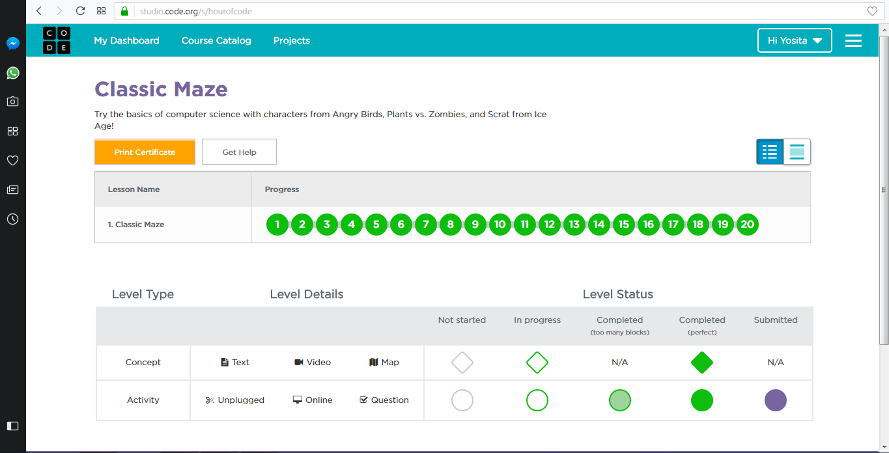
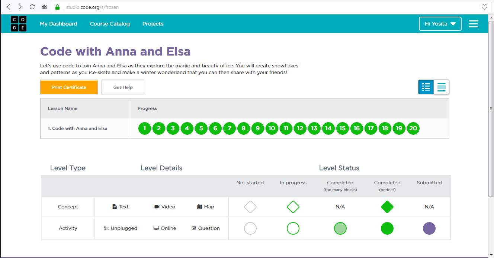
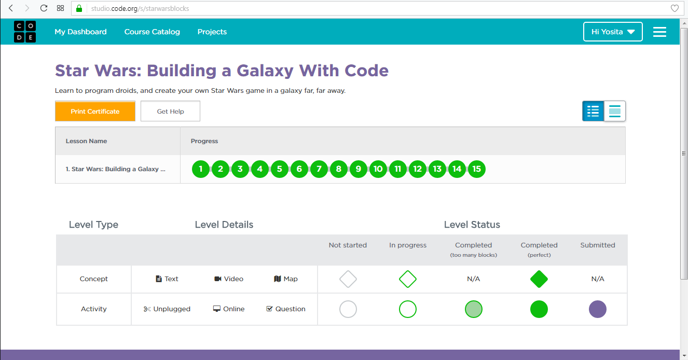
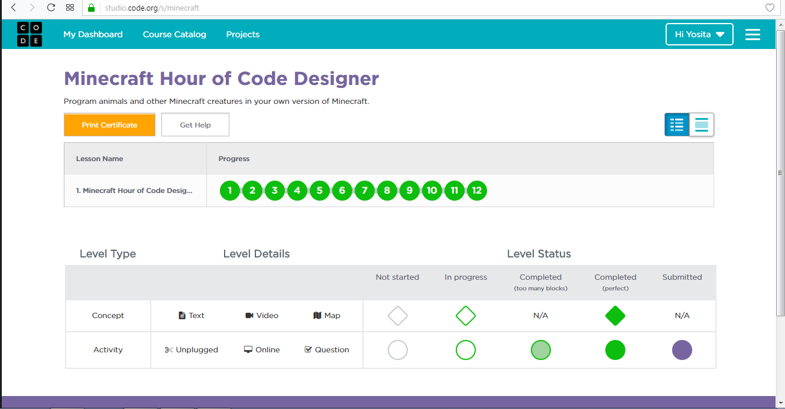

# tp_prog_week3
งานครั้งที่ 4 วิชาการเขียนโปรแกรมคอมพิวเตอร์ ปวส1

## วิธีการส่งงาน

1.  บันทึกหน้า dashboard ของแต่ละกิจกรรม
2.  **ตั้งชื่อตามนี้**
    -  Angry Bird เป็น lab1.png
    -  Frozen เป็น lab2.png
    -  Star wars เป็น lab3.png
    -  Minecraft เป็น lab4.png
3.  อัพทั้ง 4 รูปไว้ใน folder img (เมื่อสำเร็จไฟล์จะมีภาพปรากฎ)
4.  เขียนสรุปสิ่งที่ได้ด้วย

------------------------------------------

## กิจกรรมทดลอง Angry bird

### ภาพยืนยันความสมบูรณ์ (3 points)

### สรุปสิ่งที่ได้เรียนรู้จากกิจกรรม (2 points)

$$$$1

ได้ทำการเล่นอย่างยาก เพราะเรางงมาก  ที่ได้ประโยชน์คือ

1. มีการใช้งานแบบวลูป

2. มีการใช้เงื่อนไข เช่น ถ้ามีช่างทางขวาเดินไป  ถ้าไม่มี ให้เดินต่อไป

3. มีการใช้วนลูปในการเช็คของมูลว่า เราได้ของที่ต้องการหรือยัง ถ้าไม่ให้ทำต่อไปเรื่อยๆจนกว่าจะเจอสิ่งที่ต้องการ

1$$$$

-------------------------------------------

## กิจกรรมทดลอง Frozen

### ภาพยืนยันความสมบูรณ์ (3 points)

### สรุปสิ่งที่ได้เรียนรู้จากกิจกรรม (2 points)

$$$$2

มีการใช้เลี้ยวซ้าย ขวา ทำให้เกิดรูปร่างตามที่ต้องการ โดยมีการรวมคำสั่งให้เกิดรูปไว้เเล้ว

สิ่งที่ได้

1. มีความสวยงาน หน้าสนใจ มีการใช้จินตนาการสูง มีความเข้าใจในการสร้างรูปร่างต่างๆ

2. ต้องเข้าใจคำสั่งการใช้วนลูป ต้องเข้าใจในการวนกี่รอบ กรือ องศาในการเลี้ยว

3. มีคำสั่งในการวนลูปซ้ำซ้อนแต่ข้องข้างเข้าใจ

2$$$$

------------------------------------------

## กิจกรรมทดลอง Star wars

### ภาพยืนยันความสมบูรณ์ (3 points)

### สรุปสิ่งที่ได้เรียนรู้จากกิจกรรม (2 points)

$$$$3

ส่วนมากใช้เดิน เป็นการใช้คำสั่งยาวในตอนเเรก ตอนท้ายมีวนลูป

1. ต้องเข้าในการเลี้ยวซ้ายขวา

2. เข้าใจคำสั่งในการเดิน ในการสร้างตัวเ็บคะเเนน

3. ในการสร้างเกมส์ เราต้องคิดให้มาก ว่าถ้าเราเดิน เราเดินเร็วช้า ต้องใช้คำสั่งใด แต่ถ้าเราเดินเเล้วเราได้คะเนนเราต้องเพิ่มสิ่งมีชีวิตหรือไม่

3$$$$

-------------------------------------------

## กิจกรรมทดลอง Minecraft

### ภาพยืนยันความสมบูรณ์ (3 points)

### สรุปสิ่งที่ได้เรียนรู้จากกิจกรรม (2 points)

$$$$4

เป็นอะไรที่ไม่ประทับใจเลย ในด้านภาพ ในการใช้คำสั่ง หรือการเดิน

1. ใช้คำสั่งเช็ค ถ้าทำเสร็จแล้วจะได้อะไร

2. ใช้คำสั่งที่เหมือนการเล่นเกมส์ ที่เดินๆ สู้ทำล้าย ได้คะเเนนและผ่าน

4$$$$

-------------------------------------------

## สรุปคะแนน

| Topic          | Score           |
| :------------- | :-------------: |
| Angry Bird 1   |                 |
| Angry Bird 2   |                 |
| Frozen 1       |                 |
| Frozen 2       |                 |
| Star wars 1    |                 |
| Star wars 2    |                 |
| Minecraft 1    |                 |
| Minecraft 2    |                 |

**รวม :** 0 คะแนน
